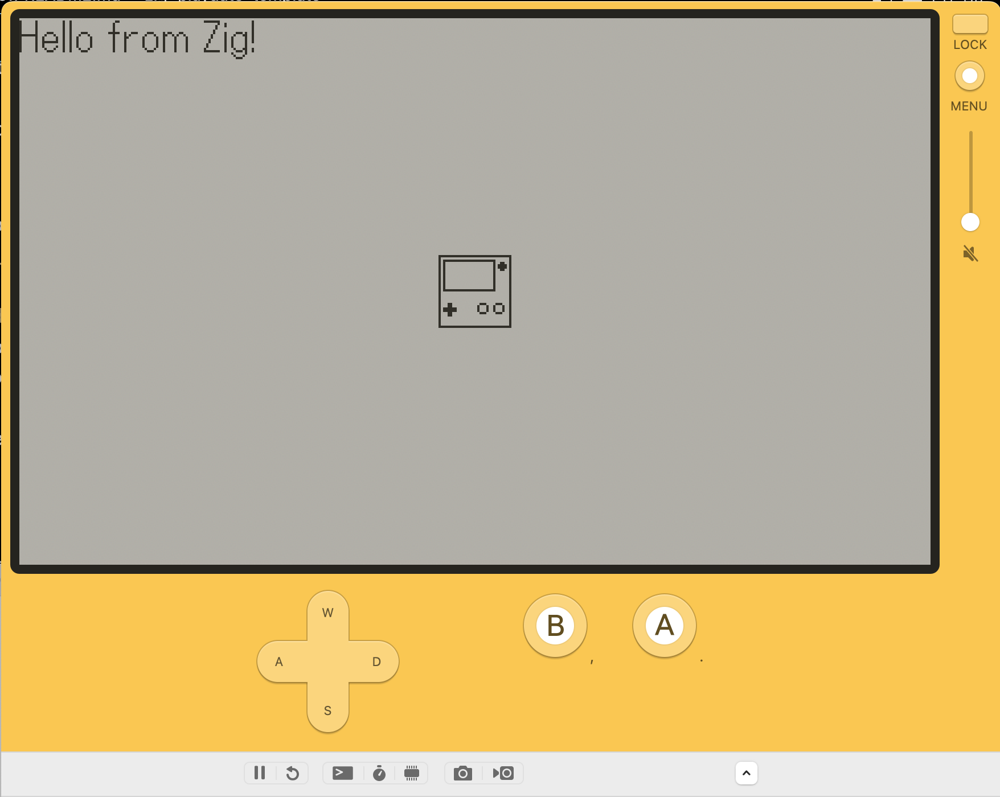

# Zig Template for Playdate

## Overview
Write your [Playdate](https://play.date) game in [Zig](https://ziglang.org)!  Use this template as a starting point to write your games in Zig.  The `build.zig` will allow you to generate a Playdate `.pdx` executable that will work both in the simulator and on hardware.

##  Requirements
- Either macOS, Windows, or Linux.
- Zig compiler that supports the "stage 2" self-hosted compiler.  Tested on 0.11.0, but in theory should support 0.10.0.
- [Playdate SDK](https://play.date/dev/) installed.
- Binutils:
    - `objcopy` is required to be in your `PATH` on macOS and Linux, while `arm-none-eabi-objcopy` is required for Windows.
    - For macOS, install binutils via homebrew with `brew install binutils`.
    - For Linux, install binutils in accordance with your distribution/package manager.
    - For Windows, follow paragraph `3.1` in the [Playdate SDK documentation](https://sdk.play.date/1.12.3/Inside%20Playdate%20with%20C.html#_install_development_tools).

## Contents
- `build.zig` -- Prepopulated with code that will generate the Playdate `.pdx` executable.
- `src/playdate_api_definitions.zig` -- Contains all of the Playdate API code.  This is supposed to be 1-to-1 with [Playdate's C API](https://sdk.play.date/1.12.3/Inside%20Playdate%20with%20C.html).  Not everything has been filled in yet.  See the [TODO](#TODO) section to see what is not yet there.
- `src/playdate_hardware_main.zig` -- This has Zig and ARM assembly code required to get the executable working on Playdate hardware.  You shouldn't need to touch this file unless you'd like use a better implementation of `__aeabi_memset`.
- `main.zig` -- Entry point for your code!  Contains example code that prints "Hello from Zig!" and an draws an example image to the screen.
- `assets/` -- This folder will contain your assets and has an example image that is drawn to the screen in the example code in `main.zig`.

## Run Example Code
1. Make sure the Playdate SDK is installed, Zig is installed and in your PATH, and all other [requirements](#Requirements) are met.
1. Make sure the Playdate Simulator is closed.
1. Run `zig build run`.
    1. If there any errors, double check `PLAYDATE_SDK_PATH` is correctly set and either binutils or the ARM Toolchain (depending on your OS) is properly installed and set in your `PATH`.
1. You should now see simulator come up and look the [screenshot here](#Screenshot).
1. Optionally, connect your Playdate to the comupter and upload to the device by going to `Device` -> `Upload Game to Device..` in the Playdate Simulator.
    1. It should load and run on the hardware as well!

## Screenshot

##  TODO
There are a few things that are not yet implemented in `src/playdate_api_definitions.zig`:
- Sprite API.
- Lua API.
- JSON API.
- Scoreboards API.
- Some of the Playdate sound filter API.  However, much of the Playdate audio API has been filled in.

