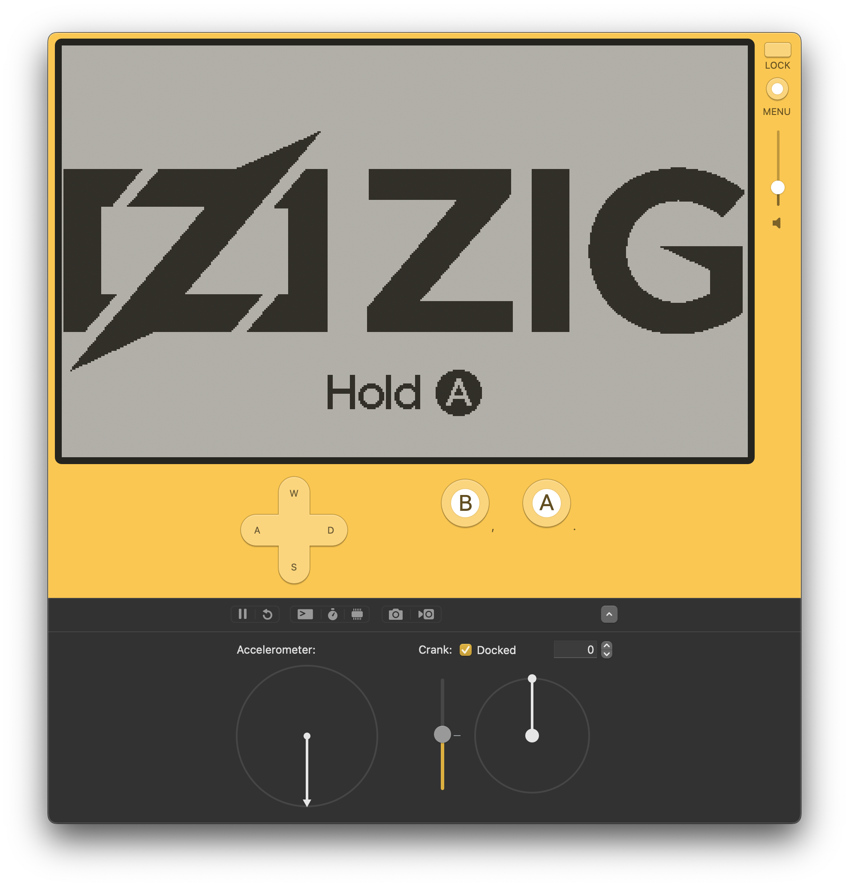
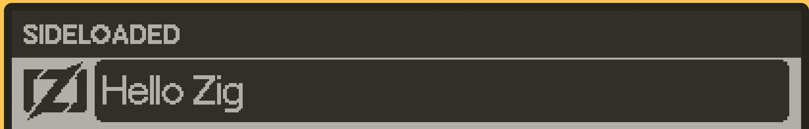

# Zig Template for Playdate

## Overview
Write your [Playdate](https://play.date) game in [Zig](https://ziglang.org)!  Use this template as a starting point to write your games in Zig.  The `build.zig` will allow you to generate a Playdate `.pdx` executable that will work both in the simulator and on hardware.

## Things To Be Aware Of
- Not Everything Has Been Tested
    - With `zig translate-c` and a bunch of customization by hand, I converted the C API of the Playdate SDK to Zig.  While I have battle tested a lot of the APIs in my upcoming Pictoblox game and in my [port of UPWARD](https://github.com/DanB91/Upward-for-Playdate), there is much of the API here that has not been tested -- especially, the Sprite, JSON, Synth, and Sound Effect APIs.  If something isn't working, please check against the headers in the Playdate SDK C API and make sure the APIs match. Please open a bug report if the APIs don't match.

- Not Officially Supported
    - While it works very well due to its interoperability with C, Zig is not officially supported on the Playdate.  If you are having any issues, feel free to open a bug report here.

- Be Mindful Of The Stack
    - You only get 10KB of stack space. That's it. I have not tested much of Zig's std on the Playdate, but std was not designed for a stack this small. See how far you can get, but you might want to write a lightweight "toolbox" library, like I did for UPWARD.  `std.fmt.bufPrintZ` works well, though!.

##  Requirements
- Either macOS, Windows, or Linux.
- Zig compiler 0.14.0 or newer. Pulling down the [latest build from master](https://ziglang.org/download/) is your best bet.
    - If you want to use the latest stable release of Zig, v0.13.0, please pull from the `template-for-zig-v0.13.0` tag of this repo.
- [Playdate SDK](https://play.date/dev/) 2.5 or later installed.

## Contents
- `build.zig` -- Prepopulated with code that will generate the Playdate `.pdx` executable.
- `src/playdate_api_definitions.zig` -- Contains all of the Playdate API code.  This is 1-to-1 with [Playdate's C API](https://sdk.play.date/2.0.0/Inside%20Playdate%20with%20C.html)
- `main.zig` -- Entry point for your code!  Contains example code that draws the Zig logo and inverts the screen colors when "A" is held.
- `panic_handler.zig` -- The default Zig panic handler will cause the simulator and hardware to crash without any error message. I wrote my own handler, so panics should now be handled gracefully with proper error messages.
- `pdxinfo` -- This contains all of the metadata for your game.  Panic provides documentation for this file [here](https://sdk.play.date/2.5.0/Inside%20Playdate.html#pdxinfo).
- `assets/` -- This folder will contain your assets and has an example image that is drawn to the screen in the example code in `main.zig`.
-  `vs-code-launch-config` -- This contains instructions and starter configuration files for running and debugging your game on Visual Studio Code.  I also made [a video](https://www.youtube.com/watch?v=PV0WbR3KiiQ) on how to do this as well.

## Cross Compilation
Zig natively supports cross-compilation.  This is leveraged to not only generate an executable that runs on the Playdate hardware, but also to generate a PDX that works on Mac, Windows, and Linux regardless of what system the game is compiled on. So, any PDX generated by this template should run on Mac, Windows, Linux, and Playdate hardware.

_**NOTE for Intel Mac users:**_ PDXs generated by this template on Windows, Linux, and M1 Macs will only run on M1 Macs.  However, if you compile on an Intel Mac, it will generate a PDX that runs on Windows, Linux, and Intel Macs.  But it will not run on M1 Macs.  When compiling on an Intel Mac, change `FORCE_COMPILE_M1_MAC` in `build.zig` to force the template to generate that run M1 Macs instead of Intel Macs. Of crucial note: if a PDX runs on an M1 Mac, it will not run on Intel Mac, and vice versa.

## Run Example Code
1. Make sure the Playdate SDK is installed, Zig is installed and in your PATH, and all other [requirements](#Requirements) are met.
1. Make sure the Playdate Simulator is closed.
1. Run `zig build run`.
    1. If there any errors, double check `PLAYDATE_SDK_PATH` is correctly set.
1. You should now see simulator come up and look the [screenshot here](#screenshot).
1. When you quit out to the home menu, change the home menu to view as list and you should see the "Hello Zig" program with a custom icon [like here](#home-screen-list-view).
1. Optionally, connect your Playdate to the comupter and upload to the device by going to `Device` -> `Upload Game to Device..` in the Playdate Simulator.
    1. It should load and run on the hardware as well!

## Other Notes
- You can generate a release build with either `zig build -Doptimize=ReleaseFast` or `zig build -Doptimize=ReleaseSafe` for a slightly slower build than ReleaseFast but with safety checks like array out-of-bounds checking. For a Playdate game, you probably want ship a ReleaseFast.

## Screenshot

## Home Screen List View

